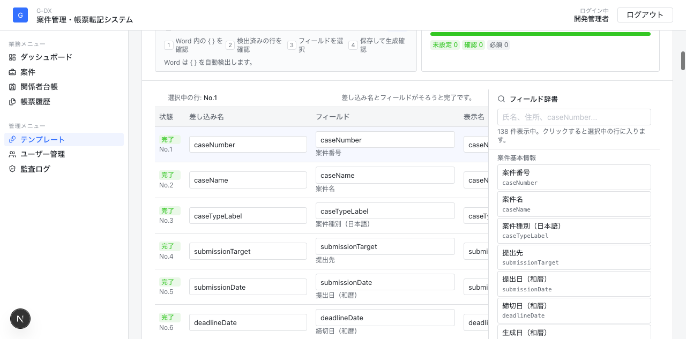
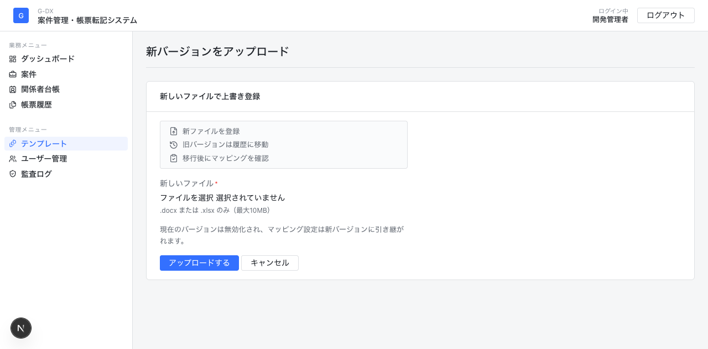

# テンプレート・マッピング手順書

この手順書は、管理者が新しい様式ファイルを登録し、帳票生成で使える状態にするためのものです。

## 1. ゴール

テンプレート作業のゴールは、次の状態にすることです。

- `.docx` または `.xlsx` の様式ファイルがテンプレート一覧に登録されている
- 「どこに転記するか」と「どの案件データを入れるか」がマッピングされている
- マッピング画面で未設定が残っていない
- 案件画面の帳票生成で転記前チェックが通る

## 2. 先に覚える言葉

| 言葉 | 意味 |
|---|---|
| テンプレート | 帳票の元ファイルです。Word は `.docx`、Excel は `.xlsx` を使います。 |
| マッピング | 様式内の転記先と、システム内のデータ項目を対応させる作業です。 |
| 差し込み名 | Word の `{applicant.name}` のような `{ }` 内の名前です。 |
| セル座標 | Excel の `B5`、`Sheet1!B5` のような転記先セルです。 |
| フィールド | システム内のデータ項目です。例: `applicant.name` は申請者氏名です。 |
| 表示名 | マッピング画面や転記前チェックで見せる分かりやすい名前です。 |
| 必須 | 値が空だと帳票生成前チェックで不足として扱う項目です。 |

## 3. 全体の流れ

1. 様式ファイルを準備する
2. テンプレート画面でアップロードする
3. 登録したテンプレートを開く
4. マッピングを確認・追加する
5. 保存する
6. 案件画面で帳票生成前チェックを行う

## 4. 様式ファイルを準備する

### Word の場合

転記したい場所に `{ }` を入れておきます。

例:

```text
申請者氏名: {applicant.name}
所在地: {parcel.locationFull}
提出日: {submissionDate}
```

注意点:

- `{` と `}` は半角で入力します
- `{ }` の中はできるだけ英数字のフィールド名にします
- 1つの転記箇所に1つの差し込み名を入れます
- Word ファイルは `.docx` にして保存します

Word はアップロード時に `{ }` を自動検出します。

### Excel の場合

Excel では、ファイル内に `{ }` を入れる必要はありません。転記したいセルを確認しておきます。

例:

```text
B5          申請者氏名
Sheet1!B8   所在地
C12         提出日
```

注意点:

- 複数シートに同じセル番地がある場合は `Sheet1!B5` の形で指定します
- Excel の「名前の定義」を使っている場合は、その名前も使えます
- Excel ファイルは `.xlsx` にして保存します

## 5. テンプレート一覧を開く

サイドメニューの `テンプレート` を開きます。


一覧で見るポイント:

- `マッピング` 列が `○件` になっているものは設定済みです
- Word で `未検出` の場合、ファイル内に `{ }` が見つかっていません
- Excel で `セル未設定` の場合、セル座標の登録がまだありません
- 既存テンプレートを差し替える場合は、一覧から対象を開いて `新バージョンをアップロード` を使います

## 6. 新しいテンプレートをアップロードする

`新規アップロード` を押します。


入力する項目:

| 項目 | 入力内容 |
|---|---|
| ファイル | `.docx` または `.xlsx` の様式ファイル |
| 様式名 | 一覧に表示する名前 |
| カテゴリ | 土地改良区、境界確定測量、建築許可、農地転用許可など |
| エリア / 都道府県 / 対象市町村 | 特定の自治体だけで使う様式の場合に設定 |
| 対応案件種別 | 対象の案件種別。未選択なら全案件種別で表示されます |
| 説明 | 用途や元ファイル名など、後から分かるメモ |

アップロード後、自動でテンプレート詳細画面へ移動します。

## 7. マッピング画面の見方

テンプレート詳細画面の `マッピング作業画面を開く` を押すと、専用のマッピング画面が開きます。


上部で見るポイント:

- `○ / ○ 件完了`
  現在どこまで設定できているかを表します
- `未設定`
  差し込み先またはフィールドが空の行です
- `確認`
  辞書未登録のフィールドや重複など、確認が必要な行です
- `完了率`
  全体の設定状況です

ボタンの意味:

| ボタン | 使う場面 |
|---|---|
| 候補を自動補完 | 差し込み名がフィールド名に近いとき、自動でフィールドを入れたい場合 |
| 空行を整理 | 途中で追加した空の行をまとめて消したい場合 |
| 行を追加 | Excel のセルや、手動で追加したい転記先がある場合 |
| 保存する | マッピング作業が終わった場合 |

## 8. マッピングを設定する

実際の作業エリアは、左がプレビュー、中央がマッピング、右がフィールド辞書です。



1行ずつ、次の順で確認します。

1. プレビュー上の差し込み名またはセルをクリックする
2. 中央の `選択中マッピング` を確認する
3. 右の `フィールド辞書` で使いたい項目を検索する
4. 辞書の項目をクリックして、選択中の行へ入れる
5. `表示名` を確認する
6. 空だと困る項目は `必須` にチェックする
7. すべて確認したら `保存する` を押す

フィールド辞書の検索例:

| 探したい項目 | 検索語の例 |
|---|---|
| 申請者氏名 | `申請者`、`氏名`、`applicant.name` |
| 所在地 | `所在地`、`parcel.locationFull` |
| 地番 | `地番`、`chiban` |
| 提出日 | `提出日`、`submissionDate` |
| 請求金額 | `請求`、`invoiceAmount` |

## 9. Word テンプレートの確認方法

Word の場合、アップロード時に `{ }` が自動検出され、プレビュー上では差し込み名として表示されます。

確認すること:

- Word 内に入れた `{ }` が行として表示されている
- プレビュー上の差し込み名をクリックすると該当行を選択できる
- 各行の `フィールド` が正しい
- `辞書未登録のパスです` が出ていない
- 不要な行があれば削除する
- 必須にしたい項目だけチェックする

よくある例:

| 状態 | 対応 |
|---|---|
| `未検出` と表示される | Word ファイルに `{ }` が入っていない可能性があります。ファイルを直して新バージョンでアップロードします。 |
| `{applicant_name}` のような旧記法がある | `候補を自動補完` を押して、現在のフィールド名に寄せます。 |
| 差し込み名を変更した | 新バージョンとしてアップロードし、検出された行を確認します。 |

## 10. Excel テンプレートの確認方法

Excel の場合、プレビュー上のセルをクリックしてセル座標を登録します。

設定例:

| セル座標 | フィールド | 表示名 |
|---|---|---|
| `B5` | `applicant.name` | 申請者氏名 |
| `Sheet1!B8` | `parcel.locationFull` | 所在地 |
| `C12` | `submissionDate` | 提出日 |

作業手順:

1. プレビュー上で転記したいセルをクリックする
2. 左の表に `B5` や `Sheet1!B5` が入ったことを確認する
3. 右のフィールド辞書から項目を選ぶ
4. 表示名を確認する
5. 必要なら `必須` にチェックする
6. セルごとに同じ作業を繰り返す
7. `保存する` を押す

注意点:

- Excel のレイアウトを変えた場合、セル座標も見直します
- 行や列を追加してセル位置がずれた場合、古いマッピングのままだと別の場所へ転記されます
- 複数シートがある場合は、できるだけ `Sheet1!B5` のようにシート名付きで登録します

## 11. 新しいファイルへ差し替える

既存テンプレートの内容を差し替える場合は、詳細画面の `新バージョンをアップロード` を使います。



新バージョンで起きること:

- 古いバージョンは無効化され、履歴として残ります
- 新しいファイルが最新版になります
- 既存のマッピングは新バージョンへ引き継がれます

アップロード後に必ず確認すること:

- Word の `{ }` が変わっていないか
- Excel のセル位置が変わっていないか
- マッピング画面で `未設定` や `確認` が残っていないか
- 保存後、案件画面で転記前チェックが通るか

## 12. 保存前チェックリスト

保存前に、次を確認してください。

- `未設定` が 0 件になっている
- `確認` が 0 件、または意図した内容だけになっている
- 同じ差し込み名やセル座標が重複していない
- 必須にしたい項目にチェックが入っている
- Word は `{ }` の名前と画面の差し込み名が一致している
- Excel はセル座標が実際の転記先と一致している

## 13. 帳票生成で確認する

マッピングを保存したら、案件画面で実際にチェックします。

1. サイドメニューの `案件` を開く
2. テストに使う案件を開く
3. `帳票生成` タブを開く
4. 登録したテンプレートを選ぶ
5. `転記前チェック` を実行する
6. 不足が出たら、案件データまたはマッピングを修正する
7. 問題がなければ帳票を生成する

最初の確認では、転記箇所のハイライトを有効にして生成すると、どこに値が入ったか確認しやすくなります。

## 14. 困ったとき

| 困ったこと | 確認すること |
|---|---|
| サイドメニューに `テンプレート` がない | 管理者権限でログインしているか確認します。 |
| Word が `未検出` になる | ファイル内に半角の `{ }` があるか確認します。 |
| Excel が `セル未設定` になる | `行を追加` してセル座標を登録します。 |
| `辞書未登録のパスです` と出る | 右のフィールド辞書から選び直します。辞書にない項目が必要な場合は開発側に追加依頼します。 |
| 保存できない | 空欄の行、重複した差し込み名/セル座標がないか確認します。 |
| 生成時に必須不足が出る | 案件データが空か、必須チェックの付け方が厳しすぎる可能性があります。 |
| 生成された場所が違う | Excel のセル座標、または Word の `{ }` の位置を確認します。 |

## 15. 試すときのおすすめ

初回は、いきなり本番用テンプレートを直さず、コピーしたファイルで試してください。

既存テンプレート画面で操作感だけ確認する場合、`保存する` を押すまではデータは更新されません。検索、行選択、フィールド辞書のクリックまでは練習できます。
