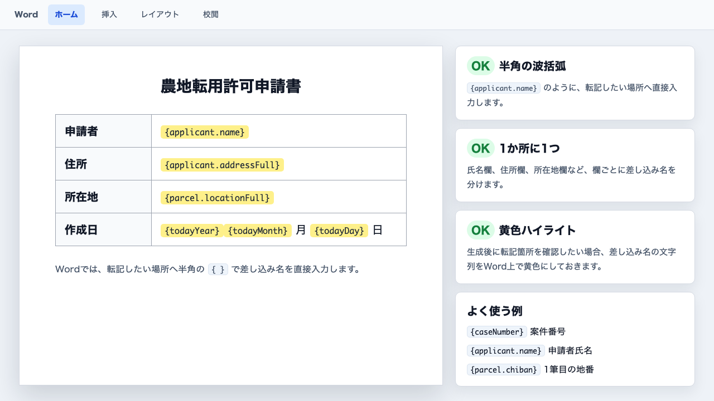
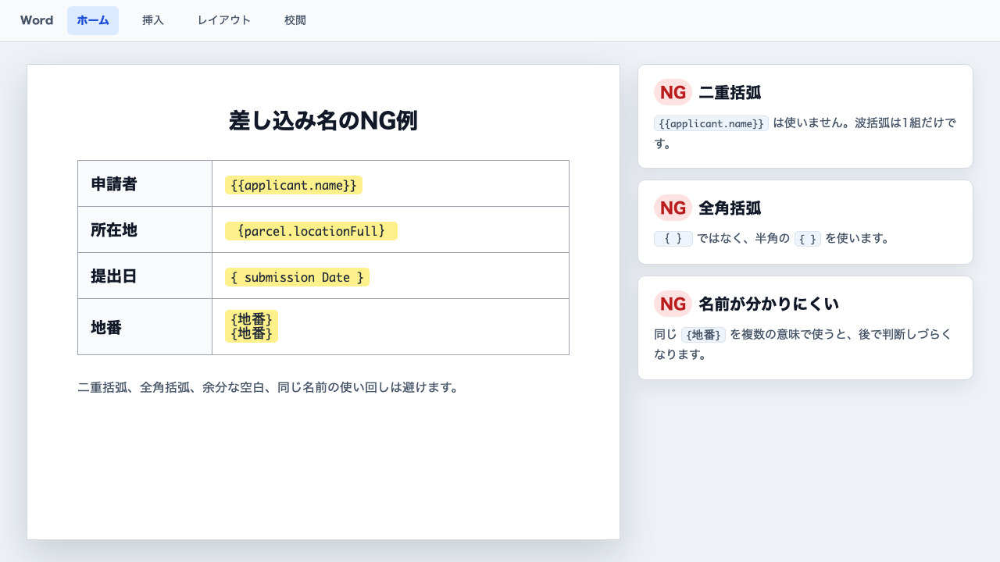
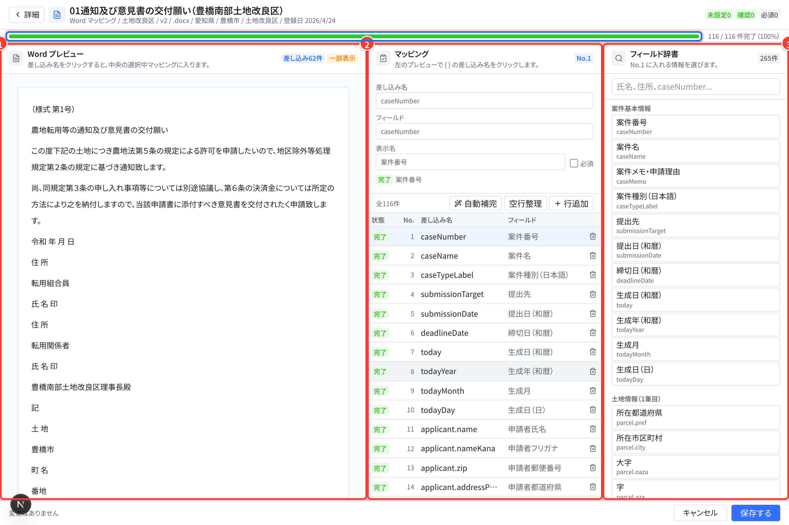
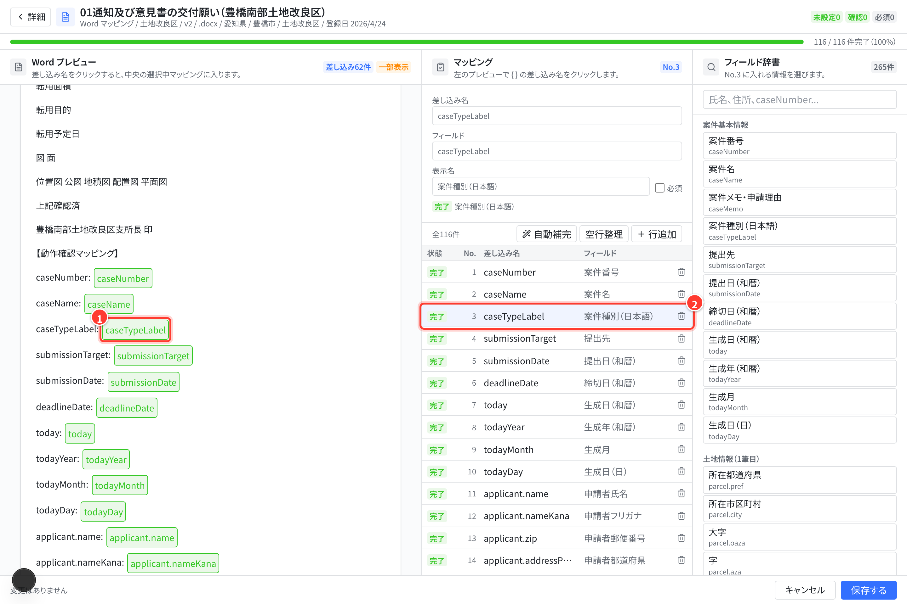
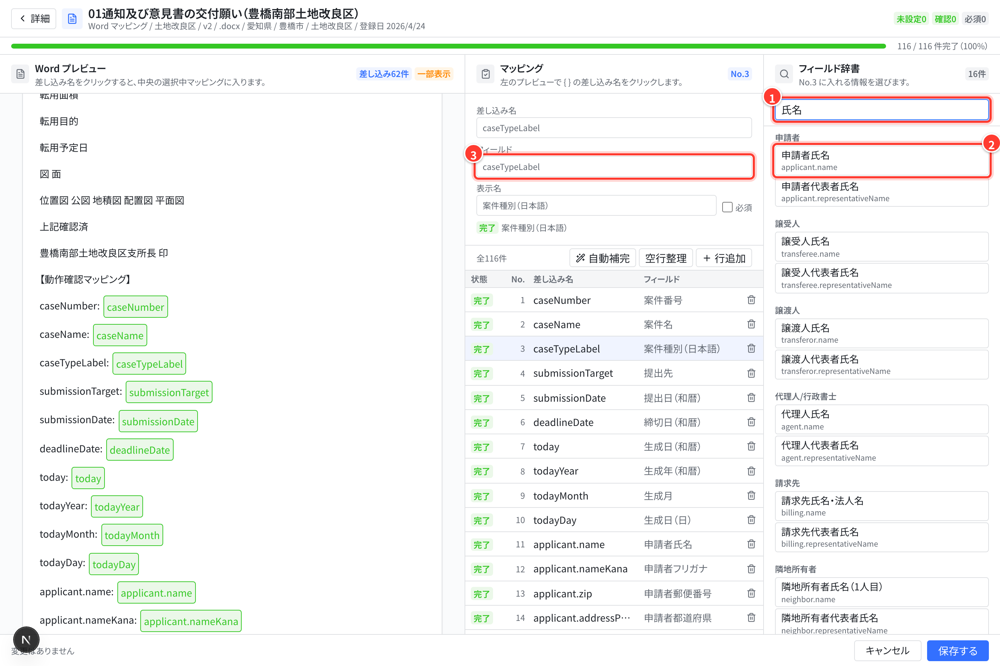
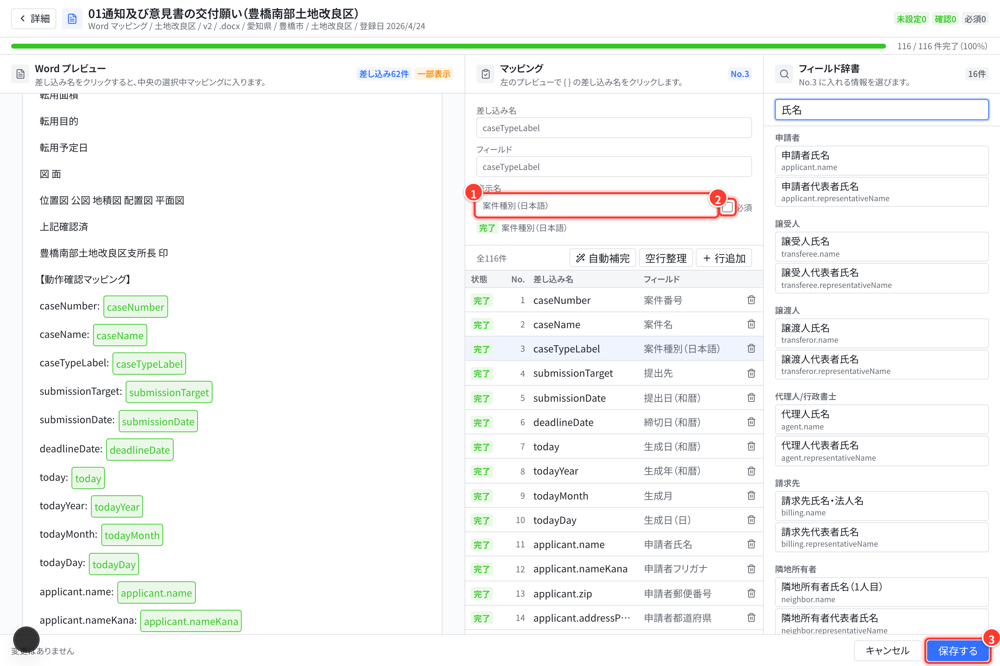
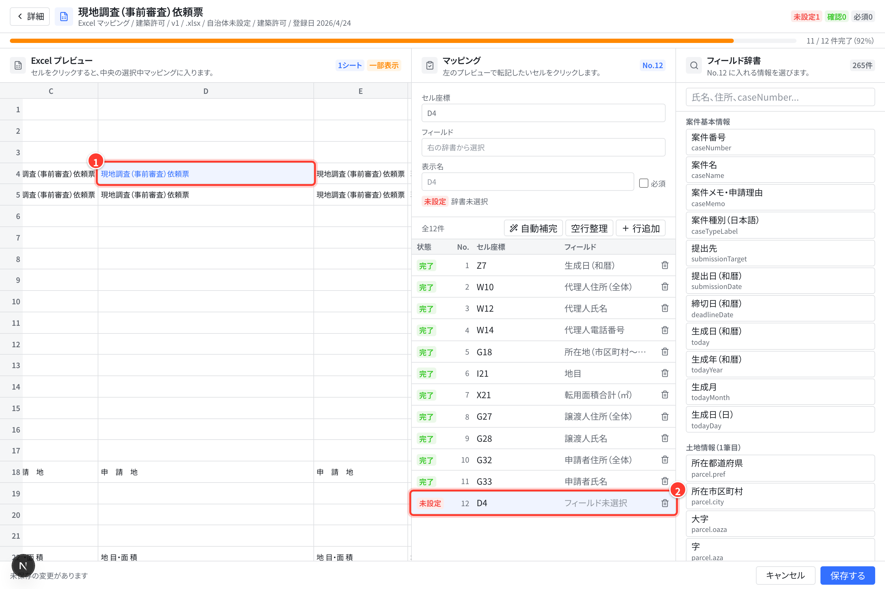
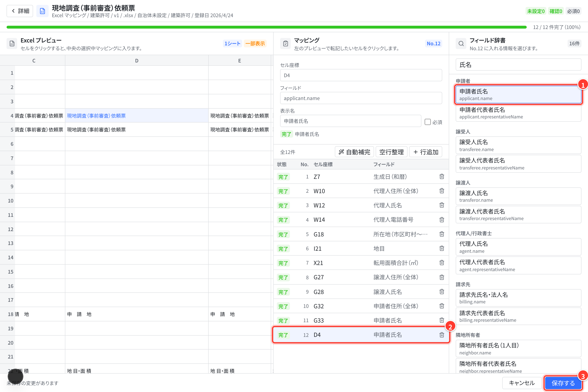
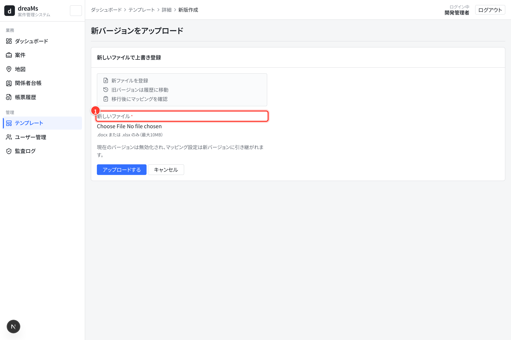
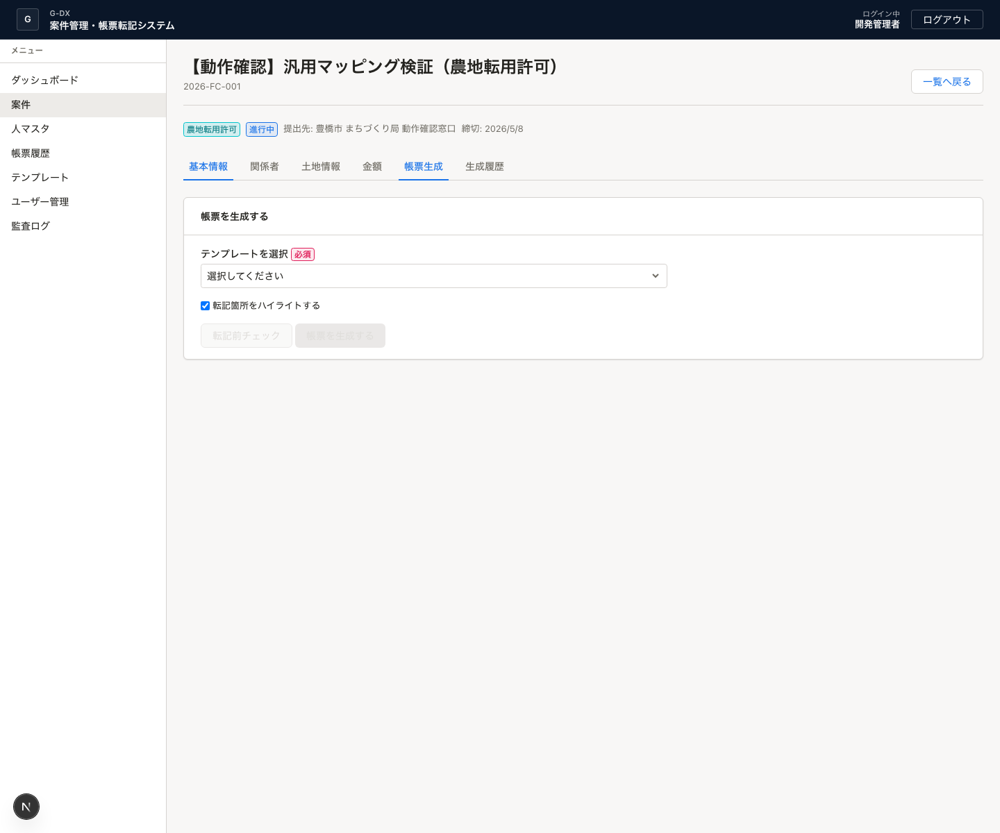

# テンプレート・マッピング作業 手順書

この手順書は、社内スタッフが新しい様式ファイルをシステムへ登録し、帳票生成で使える状態にするためのものです。画面を見ながら、上から順番に作業してください。

## 1. この作業のゴール

マッピング作業のゴールは、次の4つがすべて完了している状態です。

- `.docx` または `.xlsx` の様式ファイルがテンプレート一覧に登録されている
- 様式内の転記先と、システム内のデータ項目が対応している
- マッピング画面で `未設定` が 0 件になっている
- 案件画面の `転記前チェック` で大きな不足やエラーが出ない

この作業で一番大事なのは、様式の「どこへ入れるか」と、システムの「どの項目を入れるか」を1つずつ確認することです。

## 2. 作業前に用意するもの

作業を始める前に、次を揃えてください。

| 用意するもの | 内容 |
|---|---|
| 管理者権限のアカウント | サイドメニューに `テンプレート` が表示されるアカウントです。 |
| 様式ファイル | Word は `.docx`、Excel は `.xlsx` を使います。 |
| 何を転記したいか分かる資料 | 申請者名、所在地、地番、提出日など、様式の各欄に入れる内容が分かるものです。 |
| テスト用の案件 | 保存後に `転記前チェック` と帳票生成の確認で使います。 |

個人情報が入った本番案件でいきなり試さず、まずはテストに使ってよい案件で確認してください。

## 3. 先に覚える言葉

| 言葉 | 意味 |
|---|---|
| テンプレート | 帳票の元になる様式ファイルです。 |
| マッピング | 様式内の転記先と、システム内のデータ項目を対応させる作業です。 |
| 差し込み名 | Word の `{applicant.name}` のような `{ }` 内の名前です。 |
| セル座標 | Excel の `B5`、`Sheet1!B5` のような転記先セルです。 |
| フィールド | システム内のデータ項目です。例: `applicant.name` は申請者氏名です。 |
| 表示名 | チェック結果などに出す、人が読んで分かる名前です。 |
| 必須 | 値が空だと帳票生成前に不足として扱う項目です。 |

## 4. 全体の流れ

作業はこの順番で進めます。

1. 様式ファイルを準備する
2. Word の場合は、Word ファイル内に差し込み名を入れる
3. テンプレート画面でアップロードする
4. 登録したテンプレートを開く
5. マッピング作業画面を開く
6. 転記先ごとにフィールドを選ぶ
7. `未設定` と `確認` をつぶす
8. `保存する` を押す
9. 案件画面で `転記前チェック` を行う
10. テスト生成して出力結果を確認する

迷ったときは、次の考え方に戻ってください。

| ファイル | 作業の考え方 |
|---|---|
| Word | Word 内の `{ }` をシステムが見つけます。見つかった差し込み名に、右側のフィールド辞書から項目を割り当てます。 |
| Excel | 転記したいセルを画面でクリックするか、セル座標を入力します。そのセルに、右側のフィールド辞書から項目を割り当てます。 |

## 5. 様式ファイルを準備する

### Word の場合

転記したい場所に、半角の `{ }` で差し込み名を入れておきます。

例:

```text
申請者氏名: {applicant.name}
所在地: {parcel.locationFull}
提出日: {submissionDate}
```

Word の注意点:

- `{` と `}` は必ず半角で入力します
- 1つの転記箇所に、1つの差し込み名を入れます
- `applicant.name` のようなシステム項目名を使うと、マッピングが楽になります
- `{申請者氏名}` のような日本語名でも使えますが、画面側でフィールドを選び直します
- ファイル形式は `.docx` にします

### Excel の場合

Excel はファイル内に `{ }` を入れなくて大丈夫です。どのセルに何を入れるかを先に確認します。

例:

| セル | 入れたい内容 |
|---|---|
| `B5` | 申請者氏名 |
| `Sheet1!B8` | 所在地 |
| `C12` | 提出日 |

Excel の注意点:

- 複数シートにまたがる場合は、できるだけ `Sheet1!B5` のようにシート名付きで管理します
- 行や列を追加した後は、セル位置がずれていないか必ず確認します
- ファイル形式は `.xlsx` にします

## 6. Wordファイル側の設定方法

Word 側では、差し込みたい場所へ普通の文字として `{差し込み名}` を入力します。Word の `差し込み印刷` 機能や、フィールドコードの挿入は使いません。



基本手順:

1. 元の Word ファイルをコピーする
2. コピーした `.docx` を Word で開く
3. 氏名、住所、所在地、日付など、システムから入れたい欄を探す
4. その欄に入っているサンプル文字や空欄を `{差し込み名}` に置き換える
5. 転記箇所を後で見つけやすくしたい場合は、`{差し込み名}` の文字列を黄色ハイライトにする
6. `.docx` 形式で保存する
7. 保存したファイルをシステムへアップロードする

よく使う差し込み名:

| 入れたい内容 | Word に入れる例 |
|---|---|
| 案件番号 | `{caseNumber}` |
| 案件名 | `{caseName}` |
| 申請者氏名 | `{applicant.name}` |
| 申請者住所 | `{applicant.addressFull}` |
| 所在地（1筆目） | `{parcel.locationFull}` |
| 地番（1筆目） | `{parcel.chiban}` |
| 提出日（和暦） | `{submissionDate}` |
| 生成日 | `{today}` |
| 生成日を分けて入れる | `{todayYear}{todayMonth}月{todayDay}日` |

差し込み名の決め方:

| 方法 | 使い方 |
|---|---|
| システム項目名をそのまま使う | `{applicant.name}` のように入れます。アップロード後に自動補完しやすい方法です。 |
| 日本語名を使う | `{申請者氏名}` のように入れます。アップロード後、マッピング画面で右側のフィールド辞書から `申請者氏名` を選びます。 |
| 似た項目を区別する | `{申請者氏名}`、`{譲渡人氏名}`、`{隣地所有者氏名}` のように、何の氏名か分かる名前にします。 |

複数の土地や複数人を入れる場合:

| 入れたい内容 | Word に入れる例 |
|---|---|
| 1筆目の地番 | `{parcels[0].chiban}` |
| 2筆目の地番 | `{parcels[1].chiban}` |
| 1筆目の地積 | `{parcels[0].area}` |
| 2筆目の地積 | `{parcels[1].area}` |
| 1人目の隣地所有者氏名 | `{neighbors[0].name}` |
| 2人目の隣地所有者氏名 | `{neighbors[1].name}` |

同じ値を複数箇所に出したい場合は、同じ差し込み名を使って大丈夫です。別の値を入れたい場所には、別の差し込み名を使ってください。

### Word側のNG例

次の書き方は避けてください。



| NG | 理由 |
|---|---|
| `{{applicant.name}}` | 波括弧は1組だけです。 |
| `｛applicant.name｝` | 全角括弧では検出できません。半角の `{ }` を使います。 |
| `{ submission Date }` | 余分な空白や単語の分割は避けます。 |
| `{地番}` を1筆目と2筆目で別の意味に使う | どちらの地番か分からなくなります。 |
| `{applicant.name` | 閉じる `}` がないため検出できません。 |
| `applicant.name` | `{ }` がないため検出できません。 |

### Word側の保存前チェック

アップロード前に、Word ファイルで次を確認します。

- `.docx` 形式で保存している
- 半角の `{ }` を使っている
- 差し込み名の途中に改行が入っていない
- 差し込み名の一部だけに別の書式を当てていない
- Word の `差し込み印刷` フィールドではなく、普通の文字として入力している
- 変更履歴が残っている場合は、必要に応じて承諾・削除している
- ヘッダーやフッターに入れた差し込み名も確認している
- テキストボックス内への差し込みは、必要な場合だけにしている

Word 側でここまで確認できたら、次のテンプレート一覧へ進みます。

## 7. テンプレート一覧を開く

サイドメニューの `テンプレート` を開きます。


この画面で見る場所:

| 見る場所 | 確認内容 |
|---|---|
| 左メニュー | `テンプレート` が選択されていることを確認します。 |
| 右上 | 新しい様式を登録する場合は `新規アップロード` を押します。 |
| `マッピング` 列 | `○件` は設定済み、`未検出` や `セル未設定` は作業が必要です。 |
| `マッピングを開く` | 既存テンプレートの設定を確認・修正するときに開きます。 |

一覧で `未検出` や `セル未設定` が出ていても、まだ失敗ではありません。次のマッピング作業で設定します。

## 8. 新しいテンプレートをアップロードする

テンプレート一覧の `新規アップロード` を押します。


入力する項目:

| 項目 | 入力内容 |
|---|---|
| ファイル | `.docx` または `.xlsx` の様式ファイルを選びます。 |
| 様式名 | 一覧で見て分かる名前にします。例: `農地転用許可申請書（5条）` |
| カテゴリ | 土地改良区、境界確定測量、建築許可、農地転用許可などから選びます。 |
| エリア / 都道府県 / 対象市町村 | 特定の自治体だけで使う様式の場合に設定します。 |
| 対応案件種別 | その様式を使う案件種別にチェックします。未選択なら全案件で表示されます。 |
| 説明 | 元ファイル名、用途、注意点などをメモします。 |

入力できたら `アップロードする` を押します。アップロード後、自動でテンプレート詳細画面へ移動します。

## 9. テンプレート詳細から作業画面を開く

登録したテンプレートの詳細画面で、基本情報とマッピング状況を確認します。


この画面でやること:

1. 様式名、カテゴリ、対象自治体、ファイル形式が正しいか確認する
2. 画面内の `マッピング作業画面を開く` を押す
3. 別画面のマッピング作業画面へ移動する

既存テンプレートを差し替える場合は、右上の `新バージョンをアップロード` を使います。通常のマッピング修正だけなら、差し替えは不要です。

## 10. マッピング作業画面の見方

マッピング作業画面は、左・中央・右の3つに分かれています。



画面の役割:

| 場所 | 役割 |
|---|---|
| 左側のプレビュー | Word の差し込み名、または Excel のセルを確認する場所です。クリックすると対象行を選べます。 |
| 中央の表 | 実際にマッピングを編集する場所です。転記先、フィールド、表示名、必須を確認します。 |
| 右側のフィールド辞書 | システムにある項目を検索して選ぶ場所です。クリックすると選択中の行に入ります。 |
| 上部の件数 | `完了`、`未設定`、`確認`、`必須` の件数を見ます。 |

ステータスの意味:

| ステータス | 意味 | 対応 |
|---|---|---|
| 完了 | 転記先とフィールドが入っている状態です。 | 内容が合っているか確認します。 |
| 未設定 | 転記先またはフィールドが空です。 | 転記先とフィールドを入れます。 |
| 確認 | 重複や辞書未登録など、確認が必要です。 | 内容が正しいか見直します。 |

`保存する` を押すまでは確定しません。検索や行選択は練習しても大丈夫です。

## 11. 1行ずつマッピングする手順

基本は、1行ずつ次の順番で進めます。

1. 左側のプレビューで、転記したい差し込み名またはセルをクリックする
2. 中央の表で、選択中の行が変わったことを確認する
3. 右側の `フィールド辞書` に検索語を入れる
4. 使いたい項目をクリックする
5. 中央の `フィールド` に項目が入ったことを確認する
6. `表示名` が分かりやすい名前になっているか確認する
7. 空だと困る項目だけ `必須` にチェックする
8. 次の行へ進む

画面で見ると、次の3ステップになります。赤い番号は操作の順番です（ここでは Word を例にしています）。



1. 左のプレビューで差し込み名をクリックします。
2. 中央の一覧で、同じ差し込み名の行が選択（青く反転）されます。



1. 右上の検索欄に、探したい言葉（例: 氏名）を入力します。
2. 一覧から、入れたい項目（例: 申請者氏名）をクリックします。
3. クリックした項目が、中央の `フィールド` 欄に入ります。



1. `表示名` が分かりやすい名前になっているか確認します。
2. 値が空だと困る項目には `必須` を付けます。
3. すべての行を確認できたら、右下の `保存する` を押します。

フィールド辞書の検索例:

| 探したい項目 | 検索語の例 |
|---|---|
| 案件番号 | `案件番号`、`caseNumber` |
| 案件名 | `案件名`、`caseName` |
| 申請者氏名 | `申請者`、`氏名`、`applicant.name` |
| 所在地 | `所在地`、`parcel.locationFull` |
| 地番 | `地番`、`chiban` |
| 提出日 | `提出日`、`submissionDate` |
| 請求金額 | `請求`、`invoiceAmount` |

見つからない場合は、言い方を変えて検索します。例: `住所` で出なければ `所在地`、`氏名` で出なければ `申請者` で探します。

## 12. Word テンプレートの進め方

Word はアップロード時に `{ }` の差し込み名を自動検出します。

Word で確認すること:

- Word に入れた `{ }` が中央の表に出ている
- 差し込み名と入れたい内容が合っている
- 右のフィールド辞書から正しい項目を選べている
- `辞書未登録のパスです` が出ていない
- 不要な行があれば削除している
- 必須にしたい項目だけ `必須` にチェックしている

よくある状態と対応:

| 状態 | 対応 |
|---|---|
| 一覧で `未検出` と出る | Word ファイルに半角の `{ }` があるか確認します。なければファイルを直して新バージョンをアップロードします。 |
| `{applicant_name}` のような古い名前がある | `候補を自動補完` を押すか、右のフィールド辞書から選び直します。 |
| Word 側の差し込み名を変更した | 新バージョンとしてアップロードし、検出された行を再確認します。 |

## 13. Excel テンプレートの進め方

Excel は転記したいセルを選び、そこへフィールドを割り当てます。

作業手順:

1. 左側の Excel プレビューで転記したいセルをクリックする
2. 中央の表に `B5` や `Sheet1!B5` が入ったことを確認する
3. 右のフィールド辞書から項目を選ぶ
4. 表示名を確認する
5. 必要なら `必須` にチェックする
6. 転記したいセルの数だけ繰り返す
7. 最後に `保存する` を押す

画面で見ると、次の2ステップになります。赤い番号は操作の順番です。



1. 左のプレビューで、転記先にしたいセル（例: `D4`）をクリックします。
2. 中央の一覧に、そのセル座標の行が `未設定` で追加されます。



1. 右の検索欄で探して、入れたい項目をクリックします。
2. 行の状態が `未設定` から `完了` に変わります。
3. 必要なセルをすべて登録できたら、右下の `保存する` を押します。

設定例:

| セル座標 | フィールド | 表示名 |
|---|---|---|
| `B5` | `applicant.name` | 申請者氏名 |
| `Sheet1!B8` | `parcel.locationFull` | 所在地 |
| `C12` | `submissionDate` | 提出日 |

Excel で特に注意すること:

- 行や列を追加すると、転記先のセルがずれることがあります
- 複数シートがある場合は、シート名付きのセル座標を使うと安全です
- 似た欄が多い帳票は、セルをクリックした後に中央表の行を必ず確認します

## 14. 保存前チェックリスト

`保存する` を押す前に、必ず次を確認してください。

- `未設定` が 0 件になっている
- `確認` が 0 件、または内容を理解したうえで残している
- 同じ差し込み名やセル座標が重複していない
- Word は `{ }` の名前と画面の差し込み名が一致している
- Excel はセル座標が実際の転記先と一致している
- `必須` は、本当に空だと困る項目だけに付けている
- 表示名が、社内の人が読んで分かる名前になっている

チェックできたら `保存する` を押します。保存後、一覧の `マッピング` 件数が更新されます。

## 15. 新しいファイルへ差し替える

既存テンプレートのファイル自体を差し替える場合は、詳細画面の `新バージョンをアップロード` を使います。



新バージョンで起きること:

- 古いバージョンは無効化され、履歴として残ります
- 新しいファイルが最新版になります
- 既存のマッピングは新バージョンへ引き継がれます

差し替え後に必ず確認すること:

- Word の `{ }` が変わっていないか
- Excel のセル位置が変わっていないか
- マッピング画面で `未設定` や `確認` が残っていないか
- 保存後、案件画面で `転記前チェック` が通るか

ファイルの中身を大きく変更した場合、マッピングを引き継いでいても転記先がずれることがあります。必ず実際の帳票で確認してください。

## 16. 案件画面で転記前チェックをする

マッピングを保存したら、案件画面で実際に使えるか確認します。



確認手順:

1. サイドメニューの `案件` を開く
2. テストに使う案件を開く
3. `帳票生成` タブを開く
4. 登録したテンプレートを選ぶ
5. `転記前チェック` を押す
6. 不足が出たら、案件データまたはマッピングを修正する
7. 問題がなければ帳票を生成する

初回確認では、転記箇所のハイライトを有効にして生成すると、どこに値が入ったか確認しやすくなります。

## 17. 出力後に確認すること

生成した Word または Excel を開き、次を確認します。

| 確認項目 | 見るポイント |
|---|---|
| 値が入っているか | 申請者名、所在地、地番、日付などが空欄のままになっていないか見ます。 |
| 入る場所が正しいか | Excel は特に、1行ずれ・1列ずれがないか確認します。 |
| 表示形式が自然か | 日付、金額、氏名、住所の見た目が帳票として自然か確認します。 |
| 不要な差し込み名が残っていないか | Word に `{applicant.name}` のような文字が残っていないか見ます。 |
| ハイライトの確認 | ハイライトを有効にした場合、想定した場所だけが強調されているか見ます。 |

問題がなければ、マッピング作業は完了です。

## 18. 困ったときの確認表

| 困ったこと | 確認すること |
|---|---|
| サイドメニューに `テンプレート` がない | 管理者権限でログインしているか確認します。 |
| Word が `未検出` になる | ファイル内に半角の `{ }` があるか確認します。 |
| Excel が `セル未設定` になる | マッピング画面でセルをクリックするか、`行を追加` でセル座標を登録します。 |
| フィールドが見つからない | 右のフィールド辞書で別の検索語を試します。見つからない場合は開発側へ追加依頼します。 |
| `辞書未登録のパスです` と出る | 右のフィールド辞書から選び直します。 |
| 保存できない | 空欄の行、重複した差し込み名/セル座標がないか確認します。 |
| 生成時に必須不足が出る | 案件データが空か、必須チェックの付け方が厳しすぎる可能性があります。 |
| 生成された場所が違う | Excel のセル座標、または Word の `{ }` の位置を確認します。 |

## 19. 開発側へ相談する目安

次の場合は、自分だけで判断せず開発側へ相談してください。

- フィールド辞書に必要な項目が見つからない
- どの案件データを入れるべきか業務判断が必要
- Excel の計算式や結合セルが絡んで、転記先が分かりにくい
- Word の差し込み名が自動検出されない
- `転記前チェック` のエラー内容が分からない

相談するときは、テンプレート名、ファイル形式、困っている差し込み名またはセル座標、入れたい内容を伝えるとスムーズです。

## 20. 完了報告の書き方

作業が終わったら、次の形で報告してください。

```text
テンプレート名:
ファイル形式: Word / Excel
マッピング件数:
未設定: 0件
確認: 0件 または 内容確認済み
転記前チェック: 実施済み / 未実施
テスト生成: 問題なし / 要確認あり
メモ:
```

`未設定` が残っている場合は、完了ではありません。保存前チェックに戻ってください。

## 21. 試すときのおすすめ

初回は、本番用テンプレートを直接直さず、コピーしたファイルで試してください。

既存テンプレート画面で操作感だけ確認する場合、`保存する` を押すまではデータは更新されません。検索、行選択、フィールド辞書のクリックまでは練習できます。
